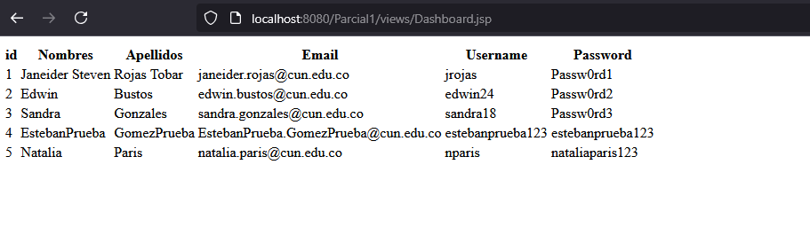

# Java Server Pages (JSP)
Este proyecto tiene como fin ampliar los conocimientos; pero esta vez, con un lenguaje como lo es **Java** dentro del entorno web.

## Versiones:
1). **JDK:** 17

2). **Maven:** 3.6.3 o superior

3). **Tomcat:** 11.0.5

## Base de Datos (BDD):
La base de datos la manejaremos en **Sql Server**.

## Ejecución Proyecto
- Al ejecutar el proyecto, nos dirigimos desde el navegador apuntando a [http://localhost:8080/Parcial1](http://localhost:8080/Parcial1)

  Visualizaremos lo siguiente:

  

- Tendremos por defecto unos usuarios de prueba en la BDD, estos son los que se utilizarán en este ejemplo y se encuentrán en el fuente
  [EstructuraParcialJSP.sql](/src/main/webapp/assets/sql/EstructuraParcialJSP.sql)

  Supongamos que ingresamos las credenciales en la pantalla de login y nos equivocamos en cualquier campo:

  

  Al oprimir en el botón **"Ingresar"** obtendremos un mensaje que nos indica que hemos ingresado **"Credenciales Incorrectas"**

  

  En caso de que ingresemos las credenciales correctas, seremos redirigidos a [Dashboard.jsp](src/main/webapp/views/Dashboard.jsp)

  **Nota:** La siguiente imagen se cambiará por una interfaz de usuario mejor; ***por ahora es solo de prueba***

  

- También se cuenta con una funcionalidad en API con solo dos métodos los cuáles son ***GET*** y ***POST***

  nos dirigimos desde el navegador apuntando a nuestro *endpoint* [http://localhost:8080/Parcial1/api/users](http://localhost:8080/Parcial1/api/users)

  - **GET:**

    Como hacemos una petición GET, este nos devolverá el listado de los usuarios que tengamos en la BDD

    

    Al igual podemos consumir el *endpoint* desde *Postman* Y veremos la misma salida.

    

  - **POST:**

    Para realizar la petición de tipo POST, apuntaremos al mismo *endpoint*; pero envíando un json con la siguiente estructura:

    ~~~
    {
      "name": "xxxx",
      "lastname": "xxxx",
      "email": "xxxxx@xxxx.com",
      "username": "xxxx",
      "password": "xxxx"
    }
    ~~~

    Desde *Postman* se vería así:

    
